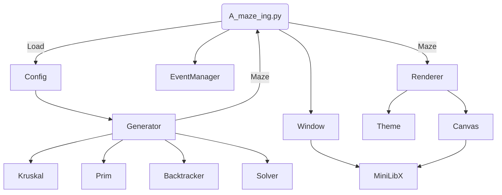

*This project has been created as part of the 42 curriculum by etrujill, ecakiray.*


# A-Maze-ing


---
## Table of Contents

- [Description](#description)
- [Quick Start](#quick-start)
- [Configuration File](#configuration-file)
- [Controls](#controls)
- [Project Structure](#project-structure)
- [Maze Generator Algorithms](#maze-generator-algorithms)
- [Solving Algorithms](#solving-algorithms)
- [Reusable Package](#reusable-package)
- [Testing](#testing)
- [Design and Development](#design-and-development)
- [Resources](#resources)

---
## Description

A-Maze-Ing is a maze generation and visualization project. It reads settings from a `config.txt` file, generates a maze with the selected size, entry, exit, algorithm, theme, and pattern options, displays it in a graphical window, solves it, and exports the maze data to a text file.

## Quick Start

## Configuration File

The program reads a plain text configuration file in `KEY=VALUE` format.

Comment lines must start with `#`.

Example:

```text
WIDTH=16
HEIGHT=16
ENTRY=0,0
EXIT=15,15
OUTPUT_FILE=maze.txt
PERFECT=True
SEED=42
GENERATOR=prim
ANIMATION=True
SPEED=300
TILE=32


### Prerequisites & Setup

### Installation

### Usage

```bash
	CONTROLS:
--------------------------------------

    Q -> Des/Activate Animation     W -> Show solution
    E -> Change solver              A -> Change generator
    R -> Remake                     T -> Print Maze Info
    S -> Style Before               D -> Next style
    F -> Random Exit                G -> Active/Disable Perfect
    Esc -> exit

```

## Structure

### Diagram

load settings -> Generator -> Algorithm -> Maze
Windows -> MLX
Event
Renderer -> Canvas



### Functions:

**A_maze_ing:**

Coordinates all the application from here.

**Config:**

Load the configuration from the file

**Generator:**

Control all the algorithms to generate Maze and solve them

**Window:**

Generate and control window obj

**EventManager:**

Manage the keyboard control

**Renderer:**

Send orders to generate Graphics

**Canvas:**

Communicates the orders directly with MlxLib


### Environment Variables

This project is designed to work with Poetry and the followed versions:

```bash
    python          (>=3.11,<3.12)
    flake8          (>=7.3.0,<8.0.0)
    mypy            (>=2.1.0,<3.0.0)
    pydantic        (>=2.13.4,<3.0.0)
    pynput          (>=1.8.2,<2.0.0)
    opencv-python   (>=4.13.0)
	mlx             (=2.2)
```

### External Tools

- `Flake8`: Python syntax control.
- `Mypy`: Python arguments and types checker.
- `Minilib` or `Mlx`: Library used to generate Graphic resources.
- `OpenCV` or `cv2`: Library to manage graphic data.
- `Pydantic`: Used to validate data from config file.


### Maze Generator Algorithms

Algorithms used:

- `Recursive Backtracker` – Starts in one cell and keeps moving to a random unvisited neighbor. When it gets stuck, it goes back until it finds a new path.
- `Kruskal` – Treats every cell as its own group and randomly removes walls only if doing so connects two different groups, avoiding loops.
- `Prim` – Starts from one cell and grows the maze by randomly connecting new neighboring cells to the existing maze.
- `Eller` – Builds the maze one row at a time, joining cells horizontally and vertically while making sure every area stays connected.
- `Wilson` – Starts with one finished cell. Every new cell takes a random walk until it reaches the maze, removing any loops made during the walk.

Algorithms descarted:

- `Hunt and Kill` – Walks randomly through unvisited cells until stuck. Then it hunts for another unvisited cell next to the maze and starts walking again.

### Solving Algorithms

Algorithms used:

- `Breadth-First Search (BFS)` – Explores all nearby paths first, then moves farther away. It always finds the shortest path in an unweighted maze.
- `Depth-First Search (DFS)` – Follows one path as far as possible before going back and trying another. It finds a path, but not always the shortest one.
- `A*` or `Astar` – Uses the distance to the goal as a guide, choosing the paths that seem most promising. It usually finds the shortest path very quickly.
- `Dijkstra` – Expands paths by always choosing the one with the lowest total cost so far. It always finds the shortest path, even when paths have different costs.

Algorithms descarted:

- `Wall Follower` – Keeps one hand on the left or right wall and follows it until reaching the exit. It works only if the maze is simply connected (all walls are connected).

### Reusable Package

The maze generation and solving logic is separated into a reusable Python package called `mazegen`.

The package source code is located under:

```text
mazegen_package/src/mazegen/
```

### Testing


## Design & Development


### Planing

### Python Version

For Python version, we decided to use a more modern version over 3.10. After check all the different versions and the different improvements. For this project, was not required to use multicore. We could not get an important advantage of the main features from the lastest versions, while we should require to work with different unknown external libraries. For these follow reasons, we decided keep the version 3.11 that we already knew and allowed us to have the followed advantages:

**Python 3.11**
- Stable and madure version
- Excellent support for scientific and graphics libraries (Most of the used for this project)
- Compatible with most packages like Numpy, SciPy, OpenCv, Pygame, etc...
- Widely used in many projects → More information and code examples

**New from 3.10**
- Faster CPython up to 10-60%.
- Fine-Grained Tracebacks: Error messages pipoint the exact failed character or expression.
- Exception Group: Allow to use `ExceptionGroup` and `except*` to handle multiple exceptions simultaneously (wonderful to use).
- TOML Support: Support to read TOML configuration files → Perfect to use with Poetry 😬👉👉.

**Disadvantages**
- Not included newest language features.
- Not proper multithread support.
- Lower performance than newest versions.

We required maximun compatibility with many packages and libreries, while we don't expect to use complex algorithms and high volume of data than could require a better performance. Almost not experience to troubleshooting compatibility issues → Run for lastest versions. 

### Virtual Environment

Working in a big Python project and how much easy would be to messy by using different packages and python versions. We decided to use a virtual environtment.

After search, specially along Reddit. We decided to keep working with `Poetry`, which already we used in the project Python08, to handle the packages, to have more control in the project than regulrar `venv`.

### Split Duties

On this point, the first thing we did, is a short guide to work more properly and professional with GIT, in order to avoid future problems.

Then, we decided that by our skills we working mainly in one part of the project, but in some point, our roles will be exchanged, to have a more deep learning experience about this project.

**Edu:**
- Graphic generation of Mazes
- Animation
- Graphic assets
- Generation algorithms
- Console style
- Structure Design
- README file


**Eray:**
- Parsing
- Settings
- Generation algorithms
- Solving algorithms
- Solution show
- Mypy & Flake8 corrections
- Makefile and packaging


### Features archieve

### Future Features and Improvements

---
## Resources

- [Python Versions](https://peps.python.org/pep-0000/)  - All information about the different Python versions.
- [Venv election](https://www.reddit.com/r/Python/comments/10bxkjp/what_are_people_using_to_organize_virtual/) Reddit post about which could be the best venv in Python (to be used in this project).
- [Git Convention](https://www.conventionalcommits.org/en/v1.0.0-beta.2/) Conventional commits information.
- [Gitignore](https://github.com/github/gitignore/blob/main/Python.gitignore) Main Resource of gitignore.
- [README Struture](https://www.freecodecamp.org/news/how-to-structure-your-readme-file/)
- [PIL Library](https://pillow.readthedocs.io/en/stable/reference/Image.html)    - Docs of PIL: to work with images with Python.
- [OpenCV](https://opencv-opencv.mintlify.app/introduction)     - Docs of OpenCV: Image manage library with Python.
- [Maze Algorithms](https://en.wikipedia.org/wiki/Maze_generation_algorithm)    - Explanation of different algorithms to generate a Maze.


# source $(poetry env info --path)/bin/activate     
