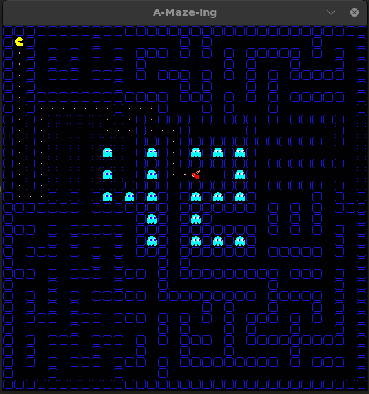
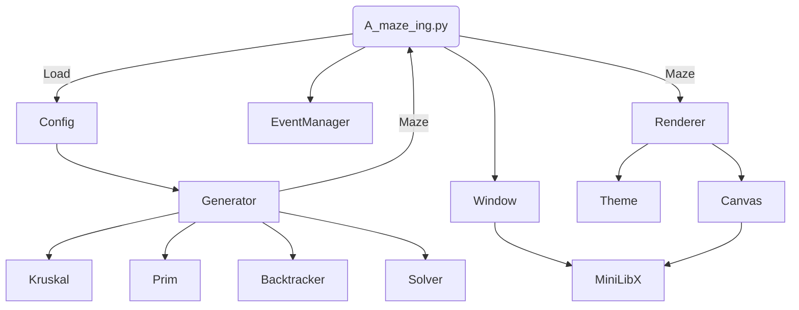

*This project has been created as part of the 42 curriculum by etrujill, ecakiray.*

<style>
pr { color: #7F58AF }
cy { color: #64C5EB }
mg { color: #E84D8A }
yw { color: #FEB326 }
h2 {color: pr}
</style>

# A-Maze-ing



---
## Table of Contents

- [Description](#description)
- [Quick Start](#quick-start)
- [Configuration File](#configuration-file)
- [Prerequisites & Setup](#prerequisites-&-setup)
- [Usage](#usage)
- [Project Structure](#project-structure)
- [Maze Generator Algorithms](#maze-generator-algorithms)
- [Solving Algorithms](#solving-algorithms)
- [Reusable Package](#reusable-package)
- [Design & Development](#design-&-development)
- [Design and Development](#design-and-development)
- [Resources](#resources)

---
## Description

A-Maze-Ing is a maze generation and visualization project. It reads settings from a `config.txt` file, generates a maze with the selected size, entry, exit, algorithm, theme, and pattern options, displays it in a graphical window, solves it, and exports the maze data to a text file.

### Funtionalities:

- 5 Different algorithms to create mazes
- 4 Solving algorithms
- 10 predesigned themes + infinite more
- Animated by choice
- Support huge sizes
- Multiple configuration options
- Controls to change the generation in real time
- Size confiuration
- Seed generator

## Quick Start

1. First install it:
`make install`

2. Run it!
`make run`

* By using Poetry as venv, may face some problems along install process due Python versions and corrupt files. Some computers may experiment few problems along installation.


## Prerequisites & Setup

Requires Python 3.11 to work properly.

### Configuration File

The program reads a plain text configuration file in `KEY=VALUE` format.

Comment lines must start with `#`.

Attributes:

| <yw>Key</yw>   | <yw>Example</yw>   | <yw>Limits</yw>   |
| :---  | :--- | :--- |
| WIDTH | WIDTH=14   | > 2 *For big screens 40-60 should be enough|
| HEIGHT| HEIGHT=10   | > 2 *For big screens 40-60 should be enough|
| ENTRY | ENTRY=0,1  | (width, heigh): 0 < number > Maze size. |
| EXIT  | EXIT=7,7  | (width, heigh): 0 < number > Maze size. |
| OUTPUT_FILE|OUTPUT_FILE=maze.txt| name for the exported maze file |
| PERFECT|PERFECT=True| True -> Only 1 path. False -> Many paths |
| --- | <mg>OPTIONALS</mg> | ---
| GENERATOR | GENERATOR=Prim | Algorithm used: [recursive_backtracker, prim, kruskal, eller, huntandkill] |
| SEED | SEED=212521555321 | Seed to generate a Maze. None by default |
| ANIMATION|ANIMATION=TRUE| Show animation or disable it. By default is True|
| PATTERN | PATTERN=None| None or Pattern name. By default is P_42|
| TILE | TILE=16 | Render size. By default is 32 |

<cy>*\*Seeds are dependent of each algorithm and entries to generate same maze.*</cy>

<cy>*\*Eller algorithm not always can generate perfect or possible maze due his nature when a pattern is used.*</cy>

<cy>*\*When ENTRY or EXIT be located in the PATTERN AREA, this will be disabled partially or totally.*</cy>


### Usage

```bash
	CONTROLS:
--------------------------------------

    Q -> Des/Activate Animation     W -> Show solution
    E -> Change solver              A -> Change generator
    R -> Remake                     T -> Print Maze Info
    S -> Style Before               D -> Next style
    F -> Random Exit                G -> Active/Disable Perfect
    Esc -> exit

```

## Diagram

Steps:
<mg>Load settings -> Generator -> Algorithm -> Maze
Windows -> MLX
Event
Renderer -> Canvas</mg>



## Project Structure

By requirements is using a main function <yw>'a_maze_ing.py'</yw>.
From here is initialled any other elements.

The code was developed by classes and abstract classes, allowing to update the code easily with new algorithms.

This design is specially good on the graphic part. Here is Renderer which have not direct comunication with the visual library, only with canvas. Canvas comunicate directly with the visual library. Both classes coming from a abstract class. This would make the project easy to adapt to another visual library by creating a new canvas or using the same canvas to a different project.

The generator part was added in a package to allow exportation and use into others projects.

All modules were to keep as minimun as possible coupled.

### Functions:

<cy>**A_maze_ing:**</cy>

Coordinates all the application from here, calling any other functions. It's for obvious reasons the more coupled module.

<cy>**Config:**</cy>

Load the configuration from the file and parse it. It makes sure that the configuration is correct.

<cy>**Generator:**</cy>

Control all the algorithms to generate Maze and solve it.

<cy>**Window:**</cy>

Generate and control window obj and control his size.

<cy>**EventManager:**</cy>

Manage the keyboard control and other possible interruptions.

<cy>**Renderer:**</cy>

Send orders to the used canvas, to generate Graphics without specify how to do it.

<cy>**Canvas:**</cy>

Communicates the orders directly with MlxLib or any other visual library.


### Environment Variables

This project is designed to work with Poetry and the followed versions:

```bash
    python          (>=3.11,<3.12)
    flake8          (>=7.3.0,<8.0.0)
    mypy            (>=2.1.0,<3.0.0)
    pydantic        (>=2.13.4,<3.0.0)
    pynput          (>=1.8.2,<2.0.0)
    opencv-python   (>=4.13.0)
	mlx             (=2.2)
```

### External Tools

- `Flake8`: Python syntax control.
- `Mypy`: Python arguments and types checker.
- `Minilib` or `Mlx`: Library used to generate Graphic resources.
- `OpenCV` or `cv2`: Library to manage graphic data.
- `Pydantic`: Used to validate data from config file.


### Maze Generator Algorithms

Algorithms used:

- `Recursive Backtracker` – Starts in one cell and keeps moving to a random unvisited neighbor. When it gets stuck, it goes back until it finds a new path.
- `Kruskal` – Treats every cell as its own group and randomly removes walls only if doing so connects two different groups, avoiding loops.
- `Prim` – Starts from one cell and grows the maze by randomly connecting new neighboring cells to the existing maze.
- `Eller` – Builds the maze one row at a time, joining cells horizontally and vertically while making sure every area stays connected.
- `Hunt and Kill` – Walks randomly through unvisited cells until stuck. Then it hunts for another unvisited cell next to the maze and starts walking again.

Algorithms descarted:

- `Wilson` – Starts with one finished cell. Every new cell takes a random walk until it reaches the maze, removing any loops made during the walk. I can take ages to make a big maze -> Descarted.

### Solving Algorithms

Algorithms used:

- `Breadth-First Search (BFS)` – Explores all nearby paths first, then moves farther away. It always finds the shortest path in an unweighted maze.
- `Depth-First Search (DFS)` – Follows one path as far as possible before going back and trying another. It finds a path, but not always the shortest one.
- `A*` or `Astar` – Uses the distance to the goal as a guide, choosing the paths that seem most promising. It usually finds the shortest path very quickly.
- `Dijkstra` – Expands paths by always choosing the one with the lowest total cost so far. It always finds the shortest path, even when paths have different costs.

Algorithms descarted:

- `Wall Follower` – Keeps one hand on the left or right wall and follows it until reaching the exit. It works only if the maze is simply connected (all walls are connected).

### Reusable Package

The maze generation and solving logic is separated into a reusable Python package called `mazegen`.

The package source code is located under:

```text
mazegen_package/src/mazegen/
```

### Maze information printed:

The maze update the information along his use.
```bash
--------------------------------------
	MAZE INFORMATION:
--------------------------------------

 Size:		30x50		Seed:		7300308836006591109
 Start:		0x0		    Algorithm:	huntandkill
 Exit:		42x19		Theme:		default
 Perfect:	False		Pattern:	None
 Solver:	dfs

```

## Design & Development

### Planing

1. Get information about the project.
2. Get information about Maze algorithms.
3. Define the requirements for this project in a todolist.
4. Design a project structure.
5. Design a guide to follow in order to don't mess with git.
6. Split duties in order to work in parallel


### Python Version

For Python version, we decided to use a more modern version over 3.10. After check all the different versions and the different improvements. For this project, was not required to use multicore. We could not get an important advantage of the main features from the lastest versions, while we should require to work with different unknown external libraries. For these follow reasons, we decided keep the version 3.11 that we already knew and allowed us to have the followed advantages:

<cy>**Python 3.11**</cy>
- Stable and madure version
- Excellent support for scientific and graphics libraries (Most of the used for this project)
- Compatible with most packages like Numpy, SciPy, OpenCv, Pygame, etc...
- Widely used in many projects → More information and code examples

<cy>**New from 3.10**</cy>
- Faster CPython up to 10-60%.
- Fine-Grained Tracebacks: Error messages pipoint the exact failed character or expression.
- Exception Group: Allow to use `ExceptionGroup` and `except*` to handle multiple exceptions simultaneously (wonderful to use).
- TOML Support: Support to read TOML configuration files → Perfect to use with Poetry 😬👉👉.

<cy>**Disadvantages**</cy>
- Not included newest language features.
- Not proper multithread support.
- Lower performance than newest versions.

We required maximun compatibility with many packages and libreries, while we don't expect to use complex algorithms and high volume of data than could require a better performance. Almost not experience to troubleshooting compatibility issues → Run for lastest versions. 

### Virtual Environment

Working in a big Python project and how much easy would be to messy by using different packages and python versions. We decided to use a virtual environtment.

After search, specially along Reddit. We decided to keep working with `Poetry`, which already we used in the project Python08, to handle the packages, to have more control in the project than regulrar `venv`.

### Split Duties

On this point, the first thing we did, is a short guide to work more properly and professional with GIT, in order to avoid future problems.

Then, we decided that by our skills we working mainly in one part of the project, but in some point, our roles will be exchanged, to have a more deep learning experience about this project.

<yw>**Edu:**</yw>
- Graphic generation of Mazes
- Animation
- Graphic assets
- Generation algorithms
- Console style
- Structure Design
- README file


<yw>**Eray:**</yw>
- Parsing
- Settings
- Generation algorithms
- Solving algorithms
- Solution show
- Mypy & Flake8 corrections
- Makefile and packaging


### Features archieve

- Works with up to 5 algorithms and 4 to resolve.
- Lot of styles or possibility to create randomly more by empty folders.
- Fast generation of maze.
- Nice controls for maze generation.
- Files easy to adapt to new algorithms or styles. Flexible project structure.

### Future Features and Improvements

- Added interface with menu to avoid dependency of terminal.
- Add new patterns.
- Option to edit and create your own themes.
- Interactive resolution controlling by arrows and with timer.

---
## Resources

- [Python Versions](https://peps.python.org/pep-0000/)  - All information about the different Python versions.
- [Venv election](https://www.reddit.com/r/Python/comments/10bxkjp/what_are_people_using_to_organize_virtual/) Reddit post about which could be the best venv in Python (to be used in this project).
- [Git Convention](https://www.conventionalcommits.org/en/v1.0.0-beta.2/) Conventional commits information.
- [Gitignore](https://github.com/github/gitignore/blob/main/Python.gitignore) Main Resource of gitignore.
- [README Struture](https://www.freecodecamp.org/news/how-to-structure-your-readme-file/)
- [PIL Library](https://pillow.readthedocs.io/en/stable/reference/Image.html)    - Docs of PIL: to work with images with Python.
- [OpenCV](https://opencv-opencv.mintlify.app/introduction)     - Docs of OpenCV: Image manage library with Python.
- [Maze Algorithms](https://en.wikipedia.org/wiki/Maze_generation_algorithm)    - Explanation of different algorithms to generate a Maze.
- [Eller Algorithm](http://www.neocomputer.org/projects/eller.html)     - Extensive Guide to make Eller.
- [Keys attrb](https://docs.oracle.com/cd/E67482_01/oscar/pdf/45/OnlineHelp_45/helpOnPS2keyCodes.html)      - List of all keyboard numbers to catch it.
- [Mlx](https://harm-smits.github.io/42docs/libs/minilibx)      - Official Mlx for documentation.
- [Mlx](https://github.com/dde-fite/42_MiniLibX_Python_Manual)      - Minilib for Python documentation.